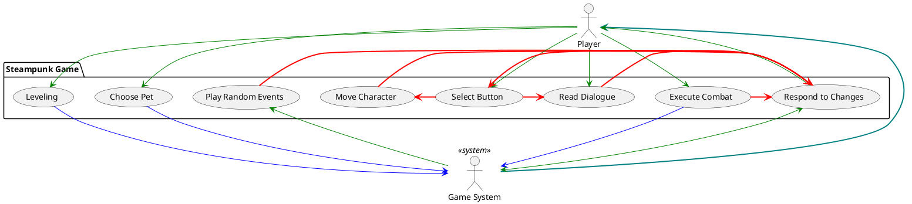

# VISION

### TARGET AUDIENCE
The game is targeted towards a young adult audience who enjoys playing RPG games.

### VALUE
Most RPGs are high fantasy - this one will explore the more niche genre of steampunk. The story is of a manufacturing
line robot that was thrown away after defects in its system were detected. General theme of anti-capitalism. A lot of people enjoy playing text-based story games on their phones as a way to kill time or to just have fun. However, most of those games are either fantasy-themed, realism, or even post-apocalypse-themed. A steampunk-themed game will add competition to the market and give a taste of fresh air to the consumers.

### FEATURES
1) A combat system that reads an input (onClick event) from the player and does it. The player should be able to pick from different options during combat turns and the system should react accordingly. The computer will use a simple implementation of choosing an action for enemies.
2) Text-based story and exploration will allow the player to pick what they want to do in the story. There will be different available dialogue options that the player can choose from that correspond to how the player wants to react.
3) Leveling up system will allow the players to build their characters the way they want to. 
4) Shopping will give players the options of buying services and pets that can affect the story and their character. All shops will use gears as currency.
5) A pet collection will allow the player to collect a myriad of unique pets that offer special benefits and perks, and switch them out whenever they want to.

### CONSTRAINTS
1) Graphical Interface that functions efficiently, adaptable, suitable for Java environments, and looks clean in an Android environment.
2) Allotted time for the project will affect the length and quality of the story.
3) Mobile implementation would also require more ways of interaction (on-touch variations like tapping or swiping) which also needs to work with the graphical interface.

## ACTORS

### PLAYER 
1) choose an option in either the dialogue, combat, and shops
2) moving through the map

### SYSTEM 
1) interpret player input
2) initiate different settings and plot points based on player input
3) combat: pick actions for enemies and calculate player and computer characters' stats and values
4) dialogue: switch settings and show correct sequential dialogue based on player input 
5) shops: correctly add pets to player inventory and implement services that the player bought 
6) relay information back to player for next input
7) keep and maintain all values and stats of both the game and characters

